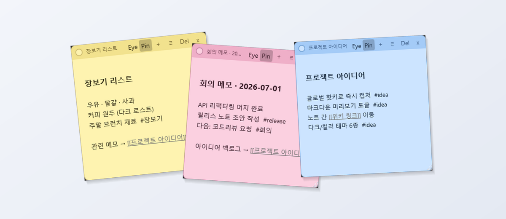
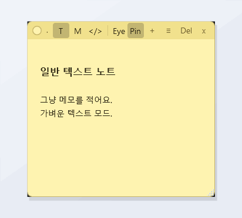
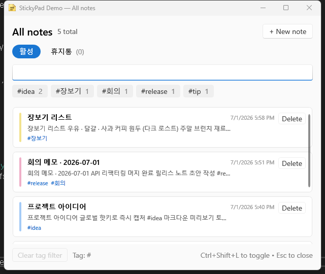
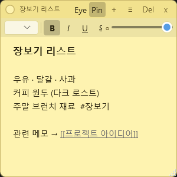
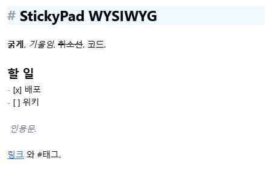

# StickyPad

[English](README.md) | **한국어**

> 📝 가볍고 빠른 Windows 스티키 노트 앱 — 즉석 기록, 리치 텍스트, 태그, 위키 스타일 링크를 모두 로컬에 저장합니다.

StickyPad는 시스템 트레이에 상주하며 단축키 한 번으로 바탕화면에 노트를 띄웁니다. 노트는 컬러풀하고 크기 조절이 가능하며, 항상 위에 고정할 수 있고 검색도 됩니다. 모든 데이터는 내장 데이터베이스에 로컬로 저장됩니다 — 계정도, 클라우드도, 원격 분석도 없습니다.



<sub>**.NET 8 · WPF · MVVM** 으로 제작. Windows 10/11, x64.</sub>

---

## 목차

- [주요 특징](#주요-특징)
- [스크린샷](#스크린샷)
- [기능](#기능)
- [키보드 단축키](#키보드-단축키)
- [시작하기](#시작하기)
  - [내려받기](#내려받기)
  - [소스에서 빌드](#소스에서-빌드)
- [사용 가이드](#사용-가이드)
- [데이터 저장 위치](#데이터-저장-위치)
- [아키텍처](#아키텍처)
- [개인정보](#개인정보)
- [로드맵](#로드맵)
- [라이선스](#라이선스)
- [감사의 말](#감사의-말)

---

## 주요 특징

- ⚡ **즉석 기록** — `Ctrl+Shift+N` 으로 아무 창도 포커스되지 않은 상태에서도 어디서나 새 노트를 띄웁니다.
- 🎨 **6가지 색상 테마** — 노랑, 분홍, 파랑, 초록, 보라, 그리고 어두운 회색.
- ✍️ **리치 텍스트** — 굵게, 기울임, 밑줄, 취소선, 목록, 할 일 체크박스, 인라인 코드, 코드 블록, 정렬, 선택 영역별 글자 크기.
- 🧩 **Markdown · HTML 렌더링** — 노트를 Markdown 또는 HTML 모드로 바꾸면 (WebView2로) 실시간 렌더링됩니다.
- 🏷️ **태그 & 검색** — 노트 안에 `#태그` 를 입력하세요. **전체 노트** 창에서 필터링과 전문(full-text) 검색을 일치 하이라이트와 함께 이용할 수 있습니다.
- 🔗 **위키 링크** — `[[노트 제목]]` 을 쓰면 노트끼리 연결되고, 클릭하면 이동합니다.
- 📂 **`.md` 파일 열기·연동** — 디스크의 Markdown/텍스트 파일을 (더블클릭, 드래그&드롭, `Ctrl+O`로) 열면 StickyPad가 노트로 렌더링합니다. 편집하면 원본 파일에 바로 저장되고, 외부 변경은 자동으로 다시 불러옵니다 — 복사가 아니라 양방향 연동입니다.
- 🗑️ **안전한 삭제** — 휴지통이 삭제한 노트를 30일간 보관한 뒤 자동으로 영구 삭제합니다.
- 🖥️ **방해되지 않게** — 트레이 아이콘, 노트별 투명도, 항상 위에 고정, 멀티 모니터 대응.
- 💾 **로컬 우선** — 내 PC의 내장 LiteDB 파일에 저장되며, 원클릭 JSON 백업 내보내기/가져오기를 지원합니다.
- 🌐 **한/영 이중 언어 UI** — Windows 언어를 자동 감지하고 설정에서 전환할 수 있습니다.
- 🗄️ **볼트 모드** — 노트를 원하는 폴더에 사람이 읽는 `.md` 파일로 저장(Obsidian 호환). 클라우드 폴더에 두면 여러 기기 동기화. **설정 → 저장소**에서 옵트인하며, 내장 데이터베이스가 기본입니다.

## 스크린샷

### 실시간 렌더링 — 텍스트 · Markdown · HTML
노트를 **텍스트 / Markdown / HTML** 사이에서 전환하면 바로 렌더링됩니다:



| 바탕화면 노트 | 전체 노트 (검색 • 태그 • 휴지통) | 노트 편집기 |
| :---: | :---: | :---: |
|  |  |  |

> 스크린샷은 [`docs/images/`](docs/images) 에 있습니다. 언제든 직접 캡처한 이미지로 교체하세요.

### 위지윅 마크다운 편집
마크다운 노트에서 **✎** 를 켜면 라이브 프리뷰 편집 — 제목·**굵게**·*기울임*·`코드`·인용·리스트가 입력하는 즉시 서식으로 보이고, 편집하지 않는 줄은 마크다운 마커가 숨겨집니다(Obsidian식). 저장은 여전히 순수 마크다운 소스라 볼트 `.md`와 그대로 왕복됩니다. 언제든 ✎ 를 꺼 원본 소스 편집으로 돌아갈 수 있습니다.



## 기능

### 노트와 편집
- 리치 텍스트 편집기(WPF `RichTextBox`) — 마우스를 올리거나 포커스되면 나타나고, 미리보기 모드에서는 숨는 툴바를 제공합니다.
- **텍스트 / Markdown / HTML 모드** — 노트마다 헤더에서 모드를 고릅니다(T / M / &lt;/&gt;). Markdown([Markdig](https://github.com/xoofx/markdig)로 렌더)과 원시 HTML은 테마가 적용된 **WebView2** 미리보기로 렌더링됩니다. `Ctrl+E` 로 소스 ⇄ 렌더링을 토글하고, 링크는 브라우저에서 열립니다.
- **위지윅 마크다운 편집** — 입력하는 즉시 서식으로 보이고 마커는 숨기는 라이브 편집. 저장은 순수 마크다운(오프라인).
- **서식:** 굵게, 기울임, 밑줄, 취소선, 글머리표·번호 목록, 좌/가운데/우 정렬, 인라인 코드와 코드 블록, 선택 영역별 글자 크기 선택.
- **할 일 체크박스** — 노트 안에서 바로 체크할 수 있는 인라인 `☐` 항목을 삽입합니다.
- **미리보기 / 편집 토글**(`Ctrl+E`) — 노트를 읽기 전용으로 잠가, 읽는 동안 실수로 텍스트를 건드리지 않게 합니다.
- **자동 제목** — 비어 있지 않은 첫 줄이 노트 제목이 됩니다(목록과 `[[링크]]`에 사용).
- **자동 저장** — 편집은 디바운스되어 자동으로 저장됩니다. 저장 버튼이 없습니다.
- **템플릿** — 노트의 **⋯** 메뉴나 트레이에서 내장 템플릿(일일 로그 · 회의록 · 할 일 목록)으로 새 노트를 만듭니다.

### 정리
- **일괄 작업** — 전체 노트 창에서 여러 노트를 체크해 한 번에 삭제하거나 색상을 바꿉니다.
- **`#태그`** 는 노트 본문에서 실시간으로 파싱되며, **전체 노트** 창에 개수와 원클릭 필터가 있는 태그 사이드바가 표시됩니다.
- 제목·태그·본문을 아우르는 **검색**은 점수 기반 랭킹과 일치 부분 하이라이트를 제공합니다.
- **`[[위키 링크]]`** 는 노트 제목으로 연결됩니다 — 클릭하면 대상 노트가 열리거나(이미 열려 있으면 포커스만 이동), 대상이 없으면 알려줍니다.
- **자동 링크 URL** — `http(s)://…` 주소는 클릭 가능해지고 브라우저에서 열립니다.

### 파일 연동 (디스크의 `.md` 열기)
- **Markdown/텍스트 파일 열기** 는 세 가지 방법: 더블클릭(StickyPad를 *연결 프로그램*으로 지정한 뒤), 아무 노트에나 **드래그&드롭**, 또는 **`Ctrl+O`** — 렌더링된 노트로 열립니다.
- **양방향 동기화** — 노트가 곧 파일입니다. 편집 내용은 원본 `.md` 에 기록되고, 다른 편집기에서 파일이 바뀌면 노트가 자동으로 다시 불러옵니다(저장하지 않은 편집이 있으면 충돌 알림이 표시됩니다).
- **비파괴적** — 연동 노트를 삭제/휴지통 이동해도 노트만 제거되고 **원본 파일은 절대 삭제되지 않습니다**. 같은 파일을 다시 열면 중복을 만들지 않고 기존 노트를 재사용합니다.
- **설계상 안전** — 읽을 때 파일 인코딩을 감지하고(BOM 인식), 쓸 때는 UTF-8. 헤더에 마우스를 올리면 파일 경로가 툴팁으로 표시됩니다.

### 창 동작
- 각 노트를 이동·크기 조절(그립)·색상 변경할 수 있으며, 위치/크기/색상/투명도는 노트마다 유지됩니다.
- **노트별 투명도**(50–100%)와 **항상 위에 고정** 핀.
- **멀티 모니터 안전** — 화면 밖에서 열릴 노트는 시작 시 보이는 영역으로 되돌립니다.
- 내용이 있는 노트를 닫으면 **숨김**(트레이에 유지)되고, 빈 노트를 닫으면 버려집니다.

### 시스템 통합
- **시스템 트레이 아이콘:** 왼쪽 클릭은 전체 표시/숨김 토글, 더블클릭은 새 노트, 오른쪽 클릭은 메뉴.
- **설정 창** — 자동 시작 토글, 전역 단축키 사용/해제, 그리고 클릭 후 키를 눌러 캡처하는 방식으로 **단축키 재지정**.
- **전역 단축키:** 어디서나 새 노트와 전체 노트 목록을 띄우며, 완전히 설정 가능(또는 끔).
- **Windows와 함께 시작** — 현재 사용자 `Run` 레지스트리 키를 통한 선택적 자동 시작.
- **자동 업데이트** — 실행 시(및 트레이의 *Check for updates…*) StickyPad가 GitHub Releases를 확인하고, 동의하면 새 빌드를 내려받아 재시작 때 자체 교체합니다. 설정에서 끌 수 있습니다.
- **검증된 업데이트** — 내려받은 업데이트를 게시된 SHA‑256 체크섬과 대조한 뒤 적용합니다.
- **단일 인스턴스** — 다시 실행하면 실행 중인 앱을 앞으로 가져오며(명령줄로 전달된 파일도 넘겨주어, `.md` 더블클릭이 실행 중인 인스턴스에서 열립니다).
- **`.md` 파일 연결** — StickyPad는 `.md`/`.markdown` 에 대해 (관리자 권한 없이, 현재 사용자에 한해) Windows *연결 프로그램* 목록에 자기 자신을 등록하며, 기본 편집기를 가로채지 않습니다.
- **언어** — 영어/한국어 UI. 기본은 Windows 언어를 따르며, 설정에서 변경합니다(재시작 후 적용).

### 데이터와 백업
- 이식 가능한 JSON 파일로 **백업 내보내기/가져오기**(트레이 메뉴).
- **텍스트로 내보내기** — 모든 활성 노트를 읽기 좋은 Markdown/`.txt` 파일 하나로(트레이 메뉴).
- **전체 노트 창에서 내보내기** — *내보내기 ▾* 버튼으로 선택한 노트를(아무것도 선택하지 않았으면 현재 필터된 목록 전체를) 스타일이 적용된 단일 **HTML** 문서, 단일 **PDF**(오프스크린 WebView2로 렌더), 또는 선택한 폴더에 **노트 1개당 Markdown 파일 1개**(YAML 프런트매터 포함)로 내보냅니다.
- **단일 노트 내보내기·인쇄** — 노트 헤더의 **⤓** 메뉴에서 현재 노트를 PDF·HTML·Markdown 으로 저장하거나 인쇄합니다.
- **볼트 (폴더 .md)** — 모든 노트를 왕복 가능한 Markdown 파일 폴더로 내보내거나 폴더에서 가져옵니다(트레이 → 볼트).
- **휴지통** — 삭제한 노트는 소프트 삭제되어 복원 가능하며, 30일 뒤 영구 삭제됩니다(시작 시에도 정리가 실행됨).
- 문제 해결용 **롤링 로그**를 7일간 보관합니다.

## 키보드 단축키

**전역(시스템 전체)** — 기본값이며, **설정**에서 재지정할 수 있습니다:

| 단축키 | 동작 |
| --- | --- |
| `Ctrl` + `Shift` + `N` | 새 노트 |
| `Ctrl` + `Shift` + `L` | **전체 노트** 창 열기 |

**노트 안에서:**

| 단축키 | 동작 |
| --- | --- |
| `Ctrl` + `B` / `I` / `U` | 굵게 / 기울임 / 밑줄 |
| `Ctrl` + `Shift` + `X` | 취소선 |
| `` Ctrl + ` `` | 인라인 코드 |
| `Ctrl` + `E` | 미리보기 / 편집 토글(읽기 전용 잠금) |
| `Ctrl` + `O` | 디스크의 Markdown/텍스트 파일 열기(연동, 양방향) |

> 정렬, 목록, 할 일 항목, 코드 블록, 글자 크기, 색상, 투명도, 고정은 마우스를 올리면 나타나는 툴바에서 사용할 수 있습니다.

## 시작하기

### 내려받기
[**Releases**](https://github.com/BaeTab/stickypad_windows/releases) 페이지에서 최신 빌드를 받아 압축을 풀고 `StickyPad.exe` 를 실행하세요.

> ⚠️ Windows에서 SmartScreen "알 수 없는 게시자" 경고가 뜰 수 있습니다(코드서명 미적용). 안전하며, 이유와 SHA‑256 검증 방법은 [설치 및 무결성 확인](docs/INSTALL.md)을 참고하세요.

자체 포함(self-contained) 빌드를 쓰지 않는 한 **[.NET 8 데스크톱 런타임](https://dotnet.microsoft.com/download/dotnet/8.0)**(x64)이 필요합니다(아래 참고). Markdown/HTML 미리보기는 **[WebView2 런타임](https://developer.microsoft.com/microsoft-edge/webview2/)**을 사용합니다 — Windows 11(및 대부분의 Windows 10)에 기본 설치되어 있습니다.

### 소스에서 빌드

**사전 요구 사항**
- [.NET 8 SDK](https://dotnet.microsoft.com/download/dotnet/8.0)
- Windows 10/11 (WPF는 Windows 전용)

**클론 & 실행**
```bash
git clone https://github.com/BaeTab/stickypad_windows.git
cd stickypad_windows
dotnet run --project stickypad
```

**배포용 exe 게시**
```bash
# 프레임워크 의존 단일 파일 (작음; .NET 8 데스크톱 런타임 필요)
dotnet publish stickypad -c Release -r win-x64 -p:PublishSingleFile=true --self-contained false -o publish/win-x64

# 또는 완전 자체 포함 (큼; 대상 PC에 런타임 불필요)
dotnet publish stickypad -c Release -r win-x64 -p:PublishSingleFile=true --self-contained true -o publish/win-x64-selfcontained
```

IDE를 선호하면 Visual Studio 2022(17.8+)에서 `stickypad.sln` 을 여세요.

## 사용 가이드

- **노트 만들기:** `Ctrl+Shift+N` 을 누르거나 트레이 아이콘을 더블클릭합니다.
- **태그 달기:** 본문 아무 곳에나 `#아이디어`, `#할일`, `#업무` 를 입력하면 전체 노트 사이드바에 태그가 나타납니다.
- **노트 연결:** `[[프로젝트 아이디어]]` 라고 쓰면 "프로젝트 아이디어" 제목의 노트를 여는 클릭 링크가 됩니다.
- **무엇이든 찾기:** `Ctrl+Shift+L` 을 누르고 검색창에 입력하면 제목·태그·본문이 하이라이트와 함께 검색됩니다.
- **여러 노트 한 번에 내보내기:** 전체 노트 창에서 원하는 노트 카드의 체크박스를 켜고(선택은 검색·필터가 바뀌어도 유지되며 "N개 선택됨" 카운트와 *전체 선택*/*선택 해제* 제공), *내보내기 ▾* → **HTML 문서로…**, **PDF로…**, 또는 **노트별 Markdown 파일로…** 를 고릅니다. 아무것도 켜지 않으면 현재 필터된 목록을 내보냅니다.
- **색상 변경 / 고정 / 반투명:** 노트의 호버 툴바에서 색을 바꾸거나, 위에 고정하거나, 투명도를 조절합니다.
- **안전하게 삭제:** 삭제하면 노트가 **휴지통** 탭으로 이동합니다. 거기서 복원하거나 휴지통을 비웁니다. 30일 지난 항목은 자동으로 영구 삭제됩니다.
- **백업:** 트레이 메뉴 → *Export backup…* 은 JSON 파일을 쓰고, *Import backup…* 은 복원합니다(같은 id 노트는 덮어씀).

### Markdown · HTML 모드

각 노트는 일반 **텍스트**, **Markdown**, 또는 **HTML** 이 될 수 있습니다. 노트 헤더의 버튼에서 모드를 고르세요:

> `T` = 텍스트(리치) · `M` = Markdown · `</>` = HTML · `👁` = 미리보기 / 편집 토글

**렌더링 단계:**
1. **`M`**(Markdown) 또는 **`</>`**(HTML)를 클릭해 노트 모드를 전환합니다.
2. 노트가 **실시간 분할** 형태가 됩니다 — **위는 소스, 아래는 렌더링된 미리보기** — 입력하는 대로 미리보기가 갱신됩니다. 구분선을 드래그해 크기를 조절합니다.
3. **`👁`(Eye)** 또는 **`Ctrl+E`** 를 누르면 **전체 화면 렌더링 보기**로 확장되고, 다시 누르면 분할로 돌아옵니다.

나중에 Markdown/HTML 노트를 **다시 열면** 같은 실시간 분할로 열립니다.

- 렌더링된 노트의 링크는 **기본 브라우저**에서 열립니다.
- 미리보기는 노트 색상에 맞춰 테마가 적용됩니다.
- 렌더링은 **WebView2 런타임**을 사용합니다(Windows 11 및 대부분의 Windows 10에 내장).

> **붙여넣기:** Markdown/HTML 모드에서는 붙여넣은 내용이 **자동으로 순수 텍스트로** 삽입되어, (브라우저나 Word에서 복사해도) 태그와 마크업이 그대로 유지됩니다.

### 디스크의 `.md` 파일 열기·연동

StickyPad에 내 PC의 Markdown/텍스트 파일을 지정하면 **렌더링된 실시간 연동** 노트로 열립니다:

- `.md` 를 아무 노트에나 **드래그&드롭**, **`Ctrl+O`** / 📂 헤더 버튼, 또는 트레이 메뉴 → *Open markdown file…* 을 사용합니다.
- 탐색기/바탕화면에서 **더블클릭:** 파일 우클릭 → *연결 프로그램* → **StickyPad**(StickyPad는 첫 실행 시 그 목록에 자기 자신을 등록합니다. *항상*을 선택하면 더블클릭으로 열립니다).

열고 나면:

1. 노트는 먼저 **렌더링된 Markdown**을 보여줍니다. **`Ctrl+E`** / 👁 버튼을 누르면 소스를 편집합니다.
2. **편집 내용은 원본 파일에 자동 저장**됩니다(디바운스) — 노트와 파일이 동기화 상태를 유지합니다.
3. 파일이 **다른 프로그램에서 변경**되면 노트가 다시 불러옵니다. 저장하지 않은 편집이 있으면 내 것을 유지할지 디스크 버전을 가져올지 묻습니다.
4. **노트를 삭제해도 파일은 유지됩니다.** 연결만 해제될 뿐, 디스크의 `.md` 는 그대로입니다.

> 헤더에 마우스를 올리면 연동된 파일의 전체 경로가 툴팁으로 표시됩니다. 지원: `.md`, `.markdown`, `.txt` 및 유사 텍스트 파일.

## 데이터 저장 위치

모든 데이터는 로컬 프로필 아래에 저장됩니다:

```
%LocalAppData%\StickyPad\
├─ notes.db         # LiteDB 내장 데이터베이스 (모든 노트 + 휴지통)
├─ settings.json    # 환경설정 (단축키, 자동 시작 등)
└─ logs\
   └─ app-YYYYMMDD.log   # 롤링 로그, 7일 보관
```

새 PC로 StickyPad를 옮기려면 `notes.db` 를 복사하거나 *Export backup…* 을 사용하세요.

## 아키텍처

MVVM 패턴과 의존성 주입을 사용하는 작고 계층화된 WPF 애플리케이션입니다.

**기술 스택**
- **UI:** WPF (.NET 8) + [WPF‑UI](https://github.com/lepoco/wpfui)
- **MVVM:** [CommunityToolkit.Mvvm](https://github.com/CommunityToolkit/dotnet)
- **호스트 & DI:** `Microsoft.Extensions.Hosting` / `DependencyInjection`
- **저장소:** [LiteDB](https://www.litedb.org/) (내장 NoSQL)
- **렌더링:** [Markdig](https://github.com/xoofx/markdig) (Markdown) + [WebView2](https://developer.microsoft.com/microsoft-edge/webview2/) (HTML 미리보기)
- **로깅:** [Serilog](https://serilog.net/) (파일 + 디버그 싱크)
- **트레이:** [H.NotifyIcon.Wpf](https://github.com/HavenDV/H.NotifyIcon)
- **단축키:** [NHotkey.Wpf](https://github.com/thomaslevesque/NHotkey)

**프로젝트 구조**
```
stickypad/
├─ App.xaml(.cs)        # 시작, DI 호스트, 단일 인스턴스, 전역 단축키
├─ Models/              # Note, AppSettings, NoteColor/Theme, 콘텐츠 포맷
├─ ViewModels/          # NoteViewModel, NotesListViewModel (+ 요약)
├─ Views/               # NoteWindow, NotesListWindow (XAML + 코드비하인드)
├─ Services/            # 리포지토리, 설정, 트레이, 창 관리자,
│                       #   단축키, 자동 시작, 백업 (인터페이스 + 구현)
└─ Utils/               # 텍스트 추출, 검색 매처, 컨버터, 아이콘
```

**주목할 설계 포인트**
- `NoteViewModel` 의 **디바운스 자동 저장**이 빠른 편집을 모아 DB 부담을 줄입니다.
- `SaveContentAsync` 는 휴지통 상태를 의도적으로 보존하여, 닫히는 창의 오래된 복사본이 노트를 "삭제 취소"하지 못하게 합니다(이 코드베이스가 명시적으로 방어하는 미묘한 버그).
- **`WindowManager`** 가 노트 창의 수명, 화면 밖 위치 보정, 가져오기/복원 시 DB 재구성을 담당합니다.
- 트레이 아이콘은 동기적으로 생성되어(`ForceCreate`) 트레이가 비어버릴 수 있는 비동기 아이콘 경로를 피합니다.

## 개인정보

StickyPad는 **로컬 우선이며 오프라인**입니다. 계정도, 네트워크 통신도, 분석도 없습니다. *사용자가* 백업 파일을 내보내지 않는 한 노트는 기기를 벗어나지 않습니다.

## 로드맵

검토 중인 아이디어(기여 환영):
- 실시간 분할 미리보기(편집 + 렌더링 나란히)
- 이미지 붙여넣기 / 첨부
- 노트 그룹화와 리마인더
- 클라우드 동기화(선택)

## 라이선스

[MIT 라이선스](LICENSE) © 2026 BaeTab 로 배포됩니다. 자유롭게 사용·수정·배포할 수 있습니다 — 자세한 내용은 LICENSE 파일을 참고하세요.

## 감사의 말

WPF‑UI, CommunityToolkit.Mvvm, LiteDB, Serilog, H.NotifyIcon, NHotkey 의 관리자분들께 감사드립니다 — StickyPad는 이들의 어깨 위에 서 있습니다.
